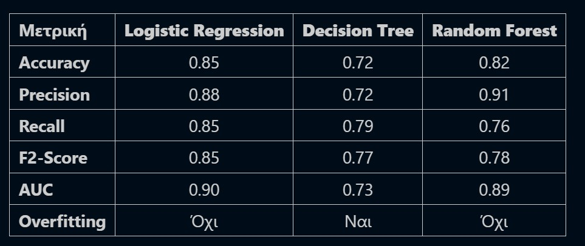
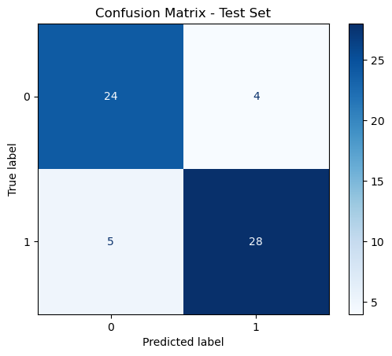
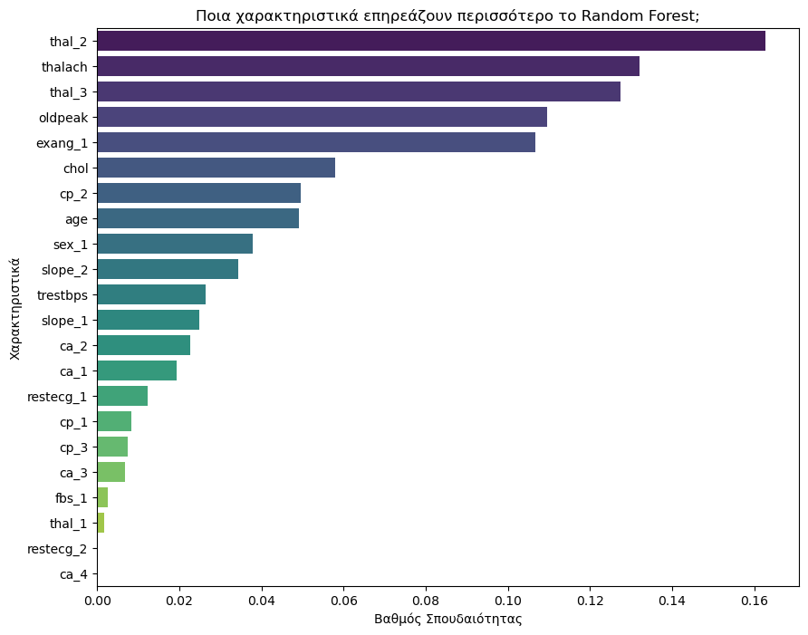
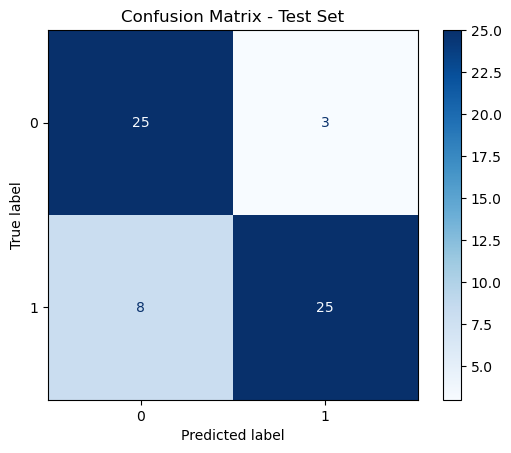
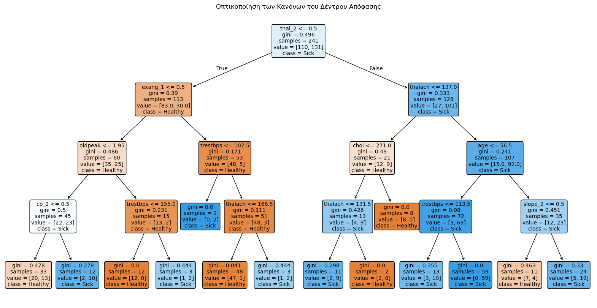
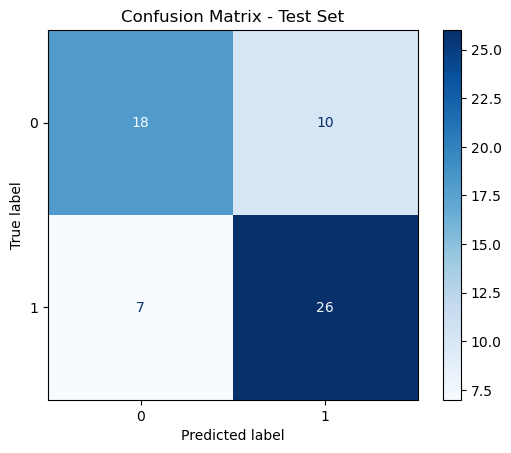

# Heart Disease Prediction: A Machine Learning Approach 🫀

## 📌 Project Overview
This project focuses on predicting the presence of heart disease in patients based on their medical and biometric data. The goal is to build a reliable classification model that can assist medical professionals in early and accurate diagnosis, utilizing transparent and interpretable algorithms.

## ⚙️ Methodology & Models
Three different machine learning algorithms were trained and evaluated on the dataset:
1. **Logistic Regression**
2. **Decision Tree Classifier**
3. **Random Forest Classifier**

## 📊 Evaluation Metric Choice: Why F2-Score?
In the medical field, a **False Negative** (predicting a patient is healthy when they actually have heart disease) is extremely dangerous and can cost lives. Therefore, standard Accuracy is not a sufficient metric. 

This project specifically evaluates models using the **F2-Score**, which puts heavier weight on **Recall** (minimizing False Negatives) while keeping False Positives at an acceptable level.

---

## 🏆 Model Comparison & Key Findings

We thoroughly evaluated the three models across multiple metrics. **Logistic Regression** emerged as the best performing model, achieving the highest Recall and F2-Score without suffering from overfitting.



---

## 📈 Visualizing the Results

### 1. Logistic Regression (Optimal Model)
Logistic Regression provided the best balance between predictive power and interpretability. As seen in the confusion matrix below, it successfully minimized the False Negatives (only 5), making it highly reliable for medical screening.



### 2. Random Forest
The Random Forest model also performed well, though with slightly lower Recall compared to Logistic Regression. 
One of its greatest advantages is the ability to extract **Feature Importance**. The chart below illustrates which patient characteristics (e.g., `thal_2`, `thalach` - maximum heart rate achieved, `oldpeak`) contribute the most to the prediction of heart disease.




### 3. Decision Tree
While the Decision Tree classifier showed signs of overfitting and had the lowest overall performance on the test set, it provides unparalleled visual interpretability. We can trace the exact logical path the model takes to classify a patient.




---

## 📂 Repository Structure
```text
├── data/
│   └── heart.csv                   # The dataset containing patient biometrics
├── images/                         # Plots and visualizations used in this README
├── notebooks/
│   └── heart_disease_prediction.ipynb  # Main analysis and modeling notebook
├── README.md
└── requirements.txt
